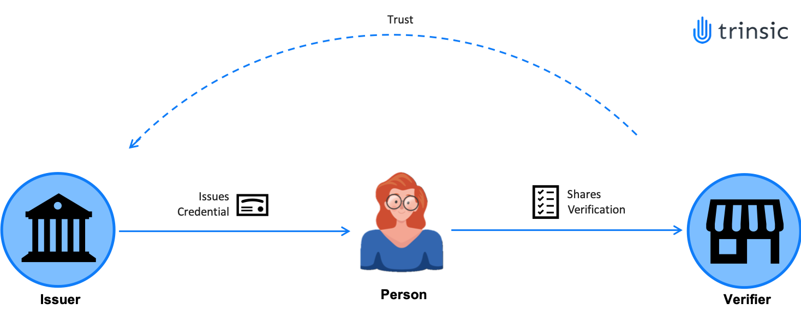

**Verifiable Credentials** or **VCs** are digital certificates that are standardized and provide a secure and private way to share information online - as they can be verified without revealing any unnecessary details. A verifiable credential is a digital representation of a person's identity information that has been cryptographically signed by an issuer. They provide an interoperable way to attest and authenticate any kind of data in an IDtech application.

When someone issues you a verifiable credential, it's stored in an SSI digital wallet, making it easy for you to securely and privately show them to others. A digital wallet is a software application and encrypted database that stores credentials, keys, and other secrets necessary for self-sovereign identity.

Trinsic currently uses a verifiable credential format that complies with the [W3C Verifiable Credential Data Model](https://www.w3.org/TR/vc-data-model/) (and that's why they're “standardized”), but we’re watching competing standards as they evolve as well (e.g. IETF ACDCs, ISO 13018-5, Anoncreds, etc). For more details on the standards we use, see [Standards](/learn/platform/standards).

Verifiable credentials are unique from other kinds of digital documents because they enable you to verify the following things:

1. The original issuing entity (the source of the data)
2. It was issued to the entity presenting it (the subject of the data)
3. It hasn't been tampered with (the veracity of the data)
4. Whether the issuer revoked the credential as of a particular point in time (the status of the data)

## Trust Triangle

- **Issuer:** The person/organization that creates the Verifiable Credential and gives it to another person/organization.
- **Holder:** The person/organization that holds the verifiable credential in their digital wallet.
- **Verifier:** The person/organization that receives and authenticates the information shared with them instantly.

An example of an **issuer** is the government, of a **holder** is a person who receives a digital ID from the government and of a **verifier** is a security agent in the airport checking your ID.

## VCs are

- **Portable:** You can easily send a credential online to anyone you.
- **Verifiable:** You can verify who's the issuer of the credential, who the credential was issued to (holder), if the information within the credential has been tampered with and whether the credential has been revoked
- **Private:** Zero-knowledge proofs allow you to select which information you wish to share on a credential, providing greater control over your personal data.
- **Tamperproof:** VCs can’t be altered/forged.

## Components of a credential

To break down the components of a credential, we'll use a digital driver's license as an example.

### Attributes, or Data

The most important part of a credential is the data inside it. 

In its simplest form, attributes are key-value pairs in a JSON object. These attributes are populated at issuance on a per-credential basis, based on a template. 

Verifiers use attributes to request only the data from credentials that they need—for example, an age-checking verifier may only request `date_of_birth` from a driver’s license, instead of the entire credential.

### Templates

Credentials are issued from templates, an abstraction provided by Trinsic that makes getting started and ongoing management easy, and enables tighter integration with other features in the Trinsic platform such as Trust Registries.

When you understand how templates work in Trinsic, you will get the benefits of semantic interoperability and Trust Registry without needing to understand the nuts and bolts of schemas, credential definitions, JSON-LD contexts, credential restrictions, and more. See our page on [templates](/learn/concepts/templates) to learn more.

### Issuer ID

Each verifiable credential is cryptographically signed by an issuer. The signature, along with the issuer’s identifier, strongly identify the issuer, ensuring anyone can verify the source of the data in the credential. 

In order to be trustworthy, the issuer’s identifier needs to be resolvable. We use decentralized identifiers (DIDs), a W3C standard, for this purpose. Trinsic offers providers a number of choices of DID methods for the issuers in their ecosystems. To learn more, read more about the [standards](/learn/platform/standards) we use and [Decentralized Identifiers <small>:material-open-in-new:</small>](https://www.w3.org/TR/did-core/){target=_blank}.